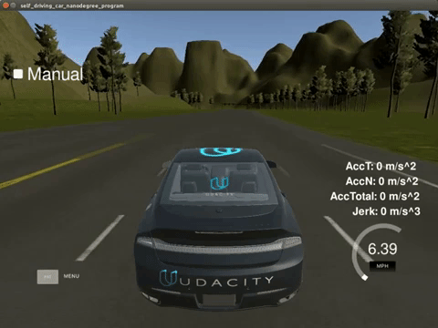

# Capstone Project
#### Self Driving Car Nano Degree
>   
>   
> ### Full Videos on YouTube  

# Objective
A Self-Driving car. This code was installed and ran on Udacity's self-driving car, Carla, in California.

# What I Learned
- ROS Nodes
- System integration
- Catkin workspaces
- Developing with a team  
- My part of the project focused on developing and integrating the waypoint updater node

**Languages**
- C++
- Python

## [WriteUp.md](WriteUp.md)
